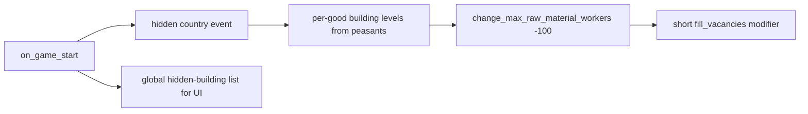

Vanilla RGOs are a parallel extraction system. A total conversion that wants **all extraction as buildings** needs a full substitution stack — not a single balance tweak.

# Pipeline



# Core pieces

| Piece | Role |
|-------|------|
| Startup event | One-shot migration for every country |
| `replace_rgos_with_buildings` | `if raw_material = goods:X` → `change_building_level_in_location` |
| `rgo_building_level` script_value | Peasants × factor, capped, ceiling to int |
| `rgo_{good}_max_level` | Dynamic `max_levels` per good |
| `location_potential` triggers | Eligibility beyond primary raw material |
| `change_max_raw_material_workers = -100` | Hard-off vanilla RGO slots |
| Global var list + scripted GUI | Hide RGO buildings unless toggled |
| Codegen templates | `$GOOD$` → N building definitions |

# Startup migration (pattern)

```txt
# on_game_start → every country fires hidden event
immediate = {
	remove_RGOs = yes   # scripted effect
}
```

Inside the effect: map each `raw_material` to `RGO_building_*`, then zero vanilla workers. Use a **precise** script_value and a **rounded** sibling when the engine needs integers.

# Building definition shape

- `category = rgo_building_category` (or equivalent)
- `max_levels = rgo_alum_max_level` (script_value, not a constant)
- `unique_production_methods` with `produced = $GOOD$`
- Maintenance inputs under `category = building_maintenance` if estates/upkeep systems need them

# UI visibility

Do not delete building types to hide them. Populate a **global variable list** of hidden types at start; scripted GUI `is_shown` checks the list + a player toggle. See [Scripted GUI building visibility filters](/gui/scripted-gui-building-visibility-filters.md) and [Custom UI patterns](/gui/custom-ui-patterns.md).

# Codegen

Hand-maintaining 50 near-identical buildings fails. Keep:

1. Templates with `$GOOD$`
2. A generator that scans goods for `raw_material`
3. Committed or CI-generated output under `building_types/`

See [Toolchain](/tooling/total-conversion-toolchain.md).

# Related

* [Change raw material](/economy/change-raw-material.md) — keep vanilla RGOs but switch goods
* QoL conversion mod design: `mod/Sire, Who Bound This Manor to a Single Merchandise/README.md`

# Citations

[1] MnT `in_game/events/MnT_rgo_removal.txt`
[2] MnT `in_game/common/scripted_effects/MnT_rgo_removal.txt`
[3] MnT `in_game/common/building_types/RGO_buildings.txt`
[4] MnT `tools/generators_from_game_data/generators/rgo_building/`
[5] [MEIOU and Taxes reference](/total-conversion/meiou-and-taxes-reference.md)
