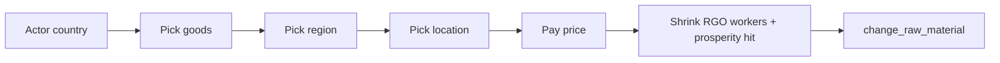

Vanilla’s **Columbian Exchange** situation actions are the best reference for a **scripted** RGO change with multi-step target picking and terrain gates. Instant flip — no year-long employment project (product design: `mod/Sire, Who Bound This Manor to a Single Merchandise/README.md`).

# Where

`in_game/common/generic_actions/columbian_exchange.txt`

Primary actions:

* `move_nw_good_to_new_location` — New World crops into Old World locations
* `move_ow_good_to_new_location` — reverse direction (same shape)

`type = situation` (tied to the Columbian Exchange situation). For a always-on QoL mod, mirror the **select_trigger / effect** shape with `type = owncountry` instead (see `markets.txt` relocate_market).

# Flow



# Pieces to copy

## 1. Price

`price = price:move_good_to_new_location` in `common/prices/00_hardcoded.txt` (prestige + gold). Define your own price key for a conversion mod.

## 2. Chained `select_trigger` blocks

Each block sets a `target_flag` scope used by later blocks and the effect:

| looking_for_a | target_flag | Role |
|---------------|-------------|------|
| `goods` | `target_good` | Which RGO to plant |
| `region` | `target_region` | Narrow the map |
| `location` | `target_location` | Final site |

Useful fields on location select:

* `map_mode = raw_material`
* `column = { data = raw_material }` / `population`
* `none_available_msg_key = "..."` for empty lists
* `ai_interaction_source_list = { ... }` to bias AI candidates

## 3. Terrain / climate eligibility

Per-good gates live in the location `visible` / allow triggers via `trigger_if` on `scope:target_good`:

```txt
trigger_if = {
	limit = { scope:target_good ?= goods:potato }
	NOT = { raw_material ?= goods:potato }
	NOT = { vegetation = desert }
	NOR = {
		climate = tropical
		climate = arid
		climate = cold_arid
		climate = arctic
	}
}
```

Also used: `topography`, `vegetation`, region/area blacklists, `area = { is_area_sea = no }`, density caps like `"raw_material_amount(scope:target_good)" < 2` per province.

**Mod takeaway:** maintain a scripted trigger per good (or a data-driven table) — do not allow every good everywhere.

## 4. Effect (instant)

```txt
effect = {
	scope:target_location ?= {
		change_max_raw_material_workers = {
			value = rgo_workers
			subtract = 1
			min = 0
			multiply = -1
		}
		change_prosperity = prosperity_weak_penalty
		change_raw_material = scope:target_good
	}
}
```

**Worker-cap math:** delta = `−(rgo_workers − 1)` → leave the location at **1** expansion (base). Example: level 4 wheat → −3 workers → level 1, then switch good. Full walkthrough: [Change raw material](/economy/change-raw-material.md#companion-rgo-worker-cap-reset-expansions-to-level-1).

See [Change raw material](/economy/change-raw-material.md).

## 5. AI (`ai_will_do`) — unit price score, not a margin %

`ai_tick = monthly`, `ai_tick_frequency = 60` (evaluate roughly every **5 years** per action).

`ai_will_do` on `move_nw_good_to_new_location` — **no fixed percentage threshold**. It is a **score** vs other AI actions:

| Step | Script | Effect |
|------|--------|--------|
| Base reluctance | `value = -1` | Bias against acting |
| Unit price delta | `add price_in_market(target); subtract price_in_market(current)` on `target_location.market` | Higher **per-unit** price favours switch |
| Scale | `multiply = 10` | Action competition weight — **not** “10% required margin” |
| Surplus penalty | `subtract = 100` if target `is_in_surplus_in_market` | Avoid oversupplied goods |
| Food | `subtract target.food_value; add current.food_value` | Food-security adjustment |

**Mod takeaway:** copy the **price read pattern** and **surplus/food guards** for pulse-based conversion AI; do **not** copy `×10` / `−1` into a `random = { chance = 2 }` pulse. For price vs **revenue/profit** when comparing staples, see [RGO conversion AI market decision](/economy/rgo-conversion-ai-market-decision.md).

# Own-country variant (no situation)

For a global “Convert RGO” cabinet action, start from `type = owncountry` + location/goods selects (same as `relocate_market` in `generic_actions/markets.txt`), not `type = situation`.

# Related

* [Change raw material](/economy/change-raw-material.md)
* [Character interaction pre-evaluation](/interactions/character-interaction-pre-evaluation.md)
* QoL conversion product docs: `mod/Sire, Who Bound This Manor to a Single Merchandise/README.md`

# Citations

[1] `in_game/common/generic_actions/columbian_exchange.txt`
[2] `in_game/common/prices/00_hardcoded.txt` — `move_good_to_new_location`
[3] `in_game/common/generic_actions/markets.txt` — `owncountry` + chained selects
