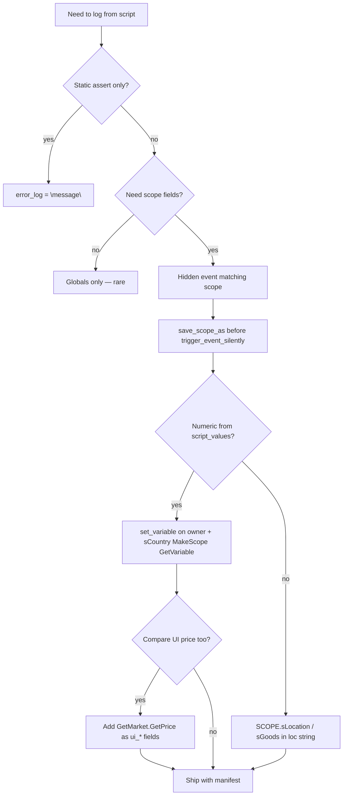

Two different systems are often conflated:

| Layer | What it is | Use for |
|-------|------------|---------|
| **Engine logs** | Files under `Documents/…/Europa Universalis V/logs/` | Parse errors, binding failures, crashes |
| **Mod telemetry** | Your `error_log = …` lines in `error.log` | Structured traces (AI picks, balance series) |

This article is the **concept map**. Step-by-step hidden-event recipe: [Script telemetry via hidden events](script-telemetry-via-hidden-events.md). Log file workflow: [Error log debugging](error-log-debugging.md).

# The `error_log` effect

From `docs/effects.log`:

```text
## error_log
Log a string to the error log when this effect executes.
error_log = message
The message can be a localization string with ROOT, SCOPE and PREV available.
Supported Scopes: none
```

**Official docs say** ROOT/SCOPE/PREV are available. **In practice** (REQ-009 AI pick sessions, 2026-07):

- Calling `error_log` from a **bare scripted_effect** (monthly pulse → location effect) behaves as if there is **no subject scope** for bindings.
- Calling from a **hidden event `immediate`** gives a real event subject, but **`ROOT.*` on location events still often fails** in loc strings.
- **`SCOPE.sLocation('saved')` / `SCOPE.sGoods('saved')`** work reliably when scopes were saved before `trigger_event_silently`.

Output format:

```text
[08:52:18][jomini_effect_impl.cpp:495]: events/my_debug_events.txt:14: SIRE_AI_PICK year=1339 tag=FRA …
```

The cited **file:line** is the event script line with `error_log`, not the loc yml.

# Vanilla usage (shipping game)

Grep of `game/` finds **four** `error_log` call sites — all **static English strings**, no dynamic bindings:

| File | Message | Context |
|------|---------|---------|
| `events/DHE/flavor_chi_treasure_expedition.txt` | `"Invalid Chinese Expedition Status"` | `else` branch — state machine assert |
| same | `"Unreachable script reached in give_exceptional_gift"` | unreachable helper |
| `events/DHE/flavor_mfa.txt` | `"Reached unreachable script in flavor_mfa.1005"` | `else` after scope search failed |
| `events/government/succession.txt` | `"succession.5 didn't find a proper regent..."` | fallback before creating regent |

**Vanilla does not ship structured telemetry** (no tag/loc/prices in `error_log`). Hidden events (`ai_area_conqest_events/hidden_events_for_ai_conquest.txt`) use `hidden = yes` + `empty_text` for **AI behaviour**, not logging.

Mod pattern for rich traces: **community** (MnT `SYS-CENSUS`, Sire REQ-009) — not vanilla.

# Two binding runtimes

| Runtime | Examples | Available in `error_log` loc? |
|---------|----------|-------------------------------|
| **Jomini script** | `price_in_market()`, triggers, `set_variable`, `ordered_goods` | Values must be **stashed** then read via loc if possible |
| **Localization / GUI data-binding** | `[SCOPE.sLocation('x').GetKey]`, `GetMarket.GetPrice` | What `error_log` actually evaluates |

**Critical:** logging failure does **not** prove script blindness. AI can read `price_in_market()` while `error_log` cannot print it directly.

Engine warning when stashing for loc:

```text
Variable 'foo' is set but is never used. Note that use in localization doesn't count
due to technical limitations.
```

Treat as expected for telemetry variables.

# Binding compatibility matrix

Tested in hidden `location_event` `immediate` after `save_scope_as` + `trigger_event_silently` (Sire REQ-009, 2026-07-16).

| Binding | Bare scripted_effect | Hidden location_event immediate | Notes |
|---------|---------------------|----------------------------------|-------|
| `[GetCurrentYear]` | Works | Works | Global |
| `[ROOT.GetOwner.GetTag]` | nullptr | **Often fails** | `Promote 'ROOT' returned nullptr` |
| `[ROOT.GetKey]` / `[ROOT.GetRawMaterial.GetKey]` | Empty | **Often fails** | Same |
| `[SCOPE.sLocation('saved').GetOwner.GetTag]` | Empty | **Works** | Preferred for tag |
| `[SCOPE.sLocation('saved').GetKey]` | Empty | **Works** | Loc id |
| `[SCOPE.sLocation('saved').GetRawMaterial.GetKey]` | Empty | **Works** | Current RGO |
| `[SCOPE.sGoods('saved').GetKey]` | Empty | **Works** | Picked good |
| `[ROOT.MakeScope.GetVariable('x').GetValue]` | — | **Fails on location** | `Could not find promote for 'MakeScope'` |
| `[SCOPE.sLocation(…).GetOwner.GetVariable('x').GetValue]` | — | **Fails** | `Could not find promote for 'GetVariable'` |
| `[SCOPE.sLocation('saved').MakeScope.GetVariable('x').GetValue]` | — | **Works** | After `set_variable` on **location** scope (not owner) |
| `[SCOPE.sCountry('saved').MakeScope.GetVariable('x').GetValue]` | — | Works for goods-scope values | `p_to` only; **not** for `raw_material` / `p_floor` |
| `[SCOPE.sLocation(…).GetMarket.GetPrice(…)]` | — | **Works** | UI/tooltip price — see below |

When a binding fails, `error.log` also logs:

```text
[pdx_data_factory.cpp:1365]: Could not find promote for 'GetVariable' in '…'
[pdx_data_factory.cpp:1042]: Failed converting statement for '…'
```

Failed fields are **omitted** from the printed line (not `0`).

# Stashing script values for numeric fields

`error_log` cannot call `price_in_market()` directly. Stash on **location scope** (current scope in the pick effect) — **not** inside `owner = { }`, where `raw_material` script_values evaluate to **0**:

```txt
rgo_conv_ai_log_pick = {
	set_variable = { name = rgo_conv_dbg_p_from  value = rgo_conv_ai_dbg_p_from  days = 1 }
	set_variable = { name = rgo_conv_dbg_p_to    value = rgo_conv_ai_dbg_p_to    days = 1 }
	set_variable = { name = rgo_conv_dbg_p_floor value = rgo_conv_ai_dbg_p_floor days = 1 }
	trigger_event_silently = my_namespace.901
}
```

Loc read:

```yml
p_from=[SCOPE.sLocation('rgo_conv_ai_pick_loc').MakeScope.GetVariable('rgo_conv_dbg_p_from').GetValue|2]
```

When telemetry works, **`p_to` should equal `ui_to` and `p_from` should equal `ui_from`** (same market, same goods). Use dot notation `scope:loc.raw_material` when stashing current-good prices — nested `scope:loc = { raw_material = … }` may stash as 0.

# Script price vs UI price

| API | Where | AI decisions? | `error_log`? |
|-----|-------|---------------|--------------|
| `price_in_market(market)` | Triggers, script_values | **Yes** | `set_variable` on location + `SCOPE.sLocation(…).MakeScope.GetVariable` |
| `Market.GetPrice(goods)` | GUI, loc bindings | Cross-check only | Direct `ui_*` in loc string |

**Same numeric value** when telemetry is wired correctly (REQ-009: 114/114 `p_to == ui_to`). Earlier apparent “divergence” was `p_from=0` from stashing in `owner` block, not different APIs. Dual-log `p_*` and `ui_*`; if `|p - ui| > 0.05` with `p_from > 0`, investigate script bug.

```yml
p_from=[SCOPE.sLocation('rgo_conv_ai_pick_loc').MakeScope.GetVariable('rgo_conv_dbg_p_from').GetValue|2]
ui_from=[SCOPE.sLocation('rgo_conv_ai_pick_loc').GetMarket.GetPrice(SCOPE.sLocation('rgo_conv_ai_pick_loc').GetRawMaterial)|2]
```

See [price_in_market in script](/economy/price-in-market-script-api.md), [Goods food vs market price](/economy/goods-food-vs-market-price.md).

# Telemetry patterns (choose one)

| Pattern | When | Example |
|---------|------|---------|
| **Static string** | Assert unreachable / invalid branch | Vanilla `flavor_chi_treasure_expedition.txt` |
| **Hidden event + loc bindings** | Scoped picks (location, goods, tag) | Sire `rgo_conversion.901` |
| **Hidden event + stashed variables** | Script numerics (`price_in_market`, scores) | Sire `rgo_conv_dbg_*` on **location** scope |
| **Delimiter protocol + coordinator** | Long balance time series | MnT `::TG::year:tag:…` — [Total conversion toolchain](/tooling/total-conversion-toolchain.md) |
| **[Data-binding macros](/tooling/data-binding-macros.md)** | Shorten repetitive binding paths | MnT `TC`, `SLV(key)` |

# Ship discipline

1. **Separate files** — `*_debug_events.txt`, `*_debug_effects.txt`, debug loc yml.
2. **Manifest** — list every path + shipping hook to remove (e.g. `DEBUG_TELEMETRY_MANIFEST.md`).
3. **`trigger_event_silently`** — no popup.
4. **`hidden = yes`**, `title = empty_text`, `desc = empty_text`, `outcome = neutral`.
5. **Mirror loc** under `main_menu/localization/` per project convention.
6. **Delete before release** — grep mod prefix in `error.log` should return nothing.

# Reload and encoding

| Pitfall | Fix |
|---------|-----|
| Edited script/loc not picked up | **Fully quit EU5** for script changes; loc/BOM fixes **may** hot-reload but verify with grep — do not rely on hot reload alone ([KI-030](/validation/known-issues.md)) |
| Lexer: `should be in utf8-bom encoding` | Save `.txt` / `.yml` as UTF-8 **with BOM** ([KI-060](/validation/known-issues.md)) |
| Loc keys missing | BOM + `*_l_english.yml` suffix |
| `error.log` shows `rgo_conv_ai_pick_log` not `SIRE_AI_PICK …` | Debug telemetry yml missing BOM — engine logs unresolved key; fix both mirrors ([KI-078](/validation/known-issues.md)) |

# Symptom quick reference

| `error.log` line tail | Meaning |
|-----------------------|---------|
| `SIRE_AI_PICK year=…` | Telemetry OK — parsers work |
| `rgo_conv_ai_pick_log` | Loc key unresolved — check UTF-8 BOM on debug yml ([KI-078](/validation/known-issues.md)) |
| `SIRE_AI_TRY` / `rgo_conv_ai_try_log` | Same pattern for funnel events |

# Grep and parse

```powershell
Select-String -Path "$env:USERPROFILE\Documents\Paradox Interactive\Europa Universalis V\logs\error.log" -Pattern "SIRE_AI_PICK"
Select-String -Path "…\error.log" -Pattern "Promote 'ROOT'|Failed converting statement|GetVariable"
```

External parsers: fixed prefix + field order (`key=value` tokens). Document column order beside the parser script ([MnT log_parser](/tooling/total-conversion-toolchain.md)).

# Decision flow



# See also

* [Script telemetry via hidden events](script-telemetry-via-hidden-events.md) — copy-paste recipe
* [Error log debugging](error-log-debugging.md) — log folder, crash dumps
* [Data-binding macros](/tooling/data-binding-macros.md) — MnT preprocessor
* [Known issues KI-075](known-issues.md) — binding mistakes
* [Known issues KI-078](known-issues.md) — loc key only in `error.log` (missing BOM)

# Citations

[1] `docs/effects.log` — `error_log`, `set_variable`  
[2] Vanilla `game/in_game/events/DHE/flavor_chi_treasure_expedition.txt` — static asserts  
[3] Vanilla `game/in_game/events/ai_area_conqest_events/hidden_events_for_ai_conquest.txt` — hidden events (no logging)  
[4] Sire REQ-009 sessions — binding matrix, dual price API  
[5] MnT `in_game/data_binding/`, `tools/plot/log_parser.py`
